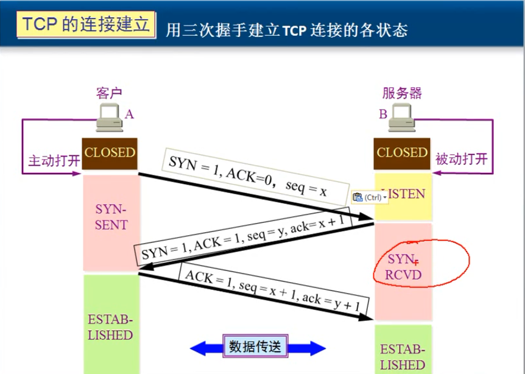
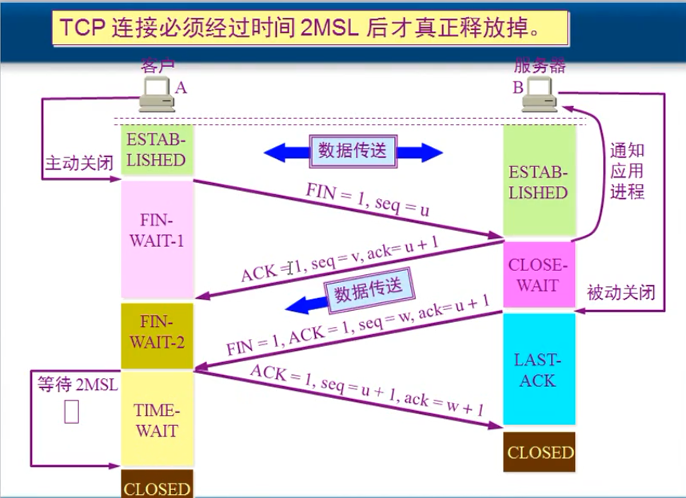

# TCP/IP基础学习
-----------
###1、什么是TCP/IP？
--------------------
    TCP/IP是供已连接因特网的计算机进行通信的通信协议。
    TCP/IP 指传输控制协议/网际协议 (Transmission Control Protocol / Internet Protocol)。
    TCP/IP 定义了电子设备（比如计算机）如何连入因特网，以及数据如何在它们之间传输的标准。
-------------------------------------
###2、TCP/IP内部包含哪些协议？
---------------------------------
    在 TCP/IP 中包含一系列用于处理数据通信的协议：
        TCP (传输控制协议) - 应用程序之间通信
        UDP (用户数据包协议) - 应用程序之间的简单通信
        IP (网际协议) - 计算机之间的通信
        ICMP (因特网消息控制协议) - 针对错误和状态
        DHCP (动态主机配置协议) - 针对动态寻址
--------------------------------
###3、TCP/IP三次握手(建立连接)与四次挥手(关闭连接)
-----------------------------------------

-----------------------------------------
    （1）第一次握手：建立连接时，客户端A发送SYN包[SYN=1,seq=x]到服务器B，并进入SYN_SEND状态，等待服务器B确认。 
    （2）第二次握手：服务器B收到SYN包，必须确认客户A的SYN，同时自己也发送一个SYN包，即SYN+ACK包[SYN=1,ACK=1,seq=y,ack=x+1]，此时服务器B进入SYN_RECV状态。 
    （3）第三次握手：客户端A收到服务器B的SYN＋ACK包，向服务器B发送确认包ACK[ACK=1,seq=x+1,ack=y+1]，此包发送完毕，客户端A和服务器B进入ESTABLISHED状态，完
         成三次握手。 完成三次握手，客户端与服务器开始传送数据。三次握手完成后，客户端和服务器就建立了TCP连接。这时可以调用accept函数获得此连接。
         三次握手的目的是连接服务器指定端口，建立TCP连接，并同步连接双方的序列号和确认号并交换TCP 窗口大小信息。在socket编程中，客户端执行connect()时，将会触发三次握手。 
-----------------------------------------

-----------------------------------------
    （1）首先A B端的TCP进程都处于established状态， 当A的应用程序传送完报文段，就会去主动关闭连接。A会停止发送报文段（但是还会接收），并向B发送[FIN = 1,seq=u]数据，之后进入FIN-WAIT-1状态； 
    （2）B接收到A发送的请求之后，会通知应用进程，A已经不再发送数据，同时B会向A发送ACK确认数据[ACK=1,seq=v,ack=u+1 ]，B进入CLOSE-WAIT状态，A接收到B发送的数据之后，A进入FIN-WAIT-2状态；此时A到B方的连接已经关闭了（即半连接状态）。 
    （3）当B的应用进程发现自己也没有数据需要传送，B应用进程就会发出被动关闭的请求，B此时向A发送[FIN=1,ACK=1,seq=w,ack=u+1]数据，并且进入LAST-ACK状态； 
    （4）A接收到B发送的数据之后，向B发送ACK确认数据[ACK =1,seq=u+1,ack=w+1]，进入TIME-WAIT状态，等待2MSL之后正常关闭连接进入CLOSED状态；B接收到A发送的确认之后进入CLOSED状态。B到A方的连接关闭！至此，TCP连接才真正全部关闭！
-----------------------------------

###4、TCP IP三次握手与四次挥手的几个问题
----------------------------------------
1、为什么建立连接协议的是三次握手，而关闭协议的是四次握手？
------------------------------------
    这是因为服务端的LISTEN状态下的SOCKET当收到客户端的SYN报文的建立连接请求后，它可以把ACK和SYN（ACK起应答作用，而SYN起同步作用）放在一个报文里来发送。但关闭连接时，当收到对方的FIN报文通知时，它仅仅表示对方没有数据发送给你了；
    但未必你所有的数据都全部发送给对方了，所以你可以未必会马上会关闭SOCKET，也即你可能还需要发送一些数据给对方之后，再发送FIN报文给对方来表示你同意现在可以关闭连接了，所以它这里的ACK报文和FIN报文多数情况下都是分开发送的。 
----------------------------------------------
2、为什么在关闭协议连接的时候，状态在time_wait是还需要等待2MSL才能关闭？
-------------------------------------------------
    这是因为虽然双方都同意关闭连接了，而且握手的4个报文也都协调和发送完毕，按理可以直接回到CLOSED状态（就好比从SYN_SEND状态到 ESTABLISH状态那样）；但是因为我们必须要假想网络是不可靠的，你无法保证你最后发送的ACK报文会一定被对方收到，
    因此对方处于 LAST_ACK状态下的SOCKET可能会因为超时未收到ACK报文，而重发FIN报文，所以这个TIME_WAIT状态的作用就是用来重发可能丢失的 ACK报文。 
---------------------------------------------
3、TCP报文结构图
----------------------------------

-------------------------
    TCP报文也分为首部和数据两部分，首部默认情况20个字节长度，但在一些需求情况下，会使用“可选字段”，这时候首部长度会有所增加。
    首部固定部分各个字段的意义如下：
    源端口和目标端口：各占2个字节，分别写入源端口号和目标端口号。
    序号：占4个字节。序号使用mod运算，TCP是面向字节流的，在一个TCP链接中传输的字节流中的每一个字节都是按顺序编号。故该字段也叫“报文段序号”
    确认序号：占4个字节。是期望收到对方下一个报文段的第一个数据字节的序号。若确认序号为N，则表明到序号N-1为止的所有数据都已正确收到
    数据偏移：占4位。表示TCP报文段首部长度。注意，“数据偏移”的单位是32位（即以4个字节为单位）。故TCP报文段的最大长度为60个字节；换言之，即报文段的数据最大为40个字节。
    保留：占6位，保留为今后使用，目前为0
    窗口：占2个字节，用于TCP流量控制，告诉接收端TCP缓冲区还能接收多少字节。
    校验和：占2个字节，发送端填充，接收端对报文端执行CRC算法以校验TCP报文段在传输过程中是否损坏。
    紧急指针：占2个字节，在URG标志位设置了时才生效，与序号字段的值相加后表示最后一个紧急数据的下一字节的序号，可以说这个字段是紧急指针相对当前序号的偏移。
    选项：即TCP的数据部分，长度可变，但必须是4字节的整数倍。
-----------------------------------------------

###5、TPC/IP模型与socket关系
--------------------------------------
   
--------------------------------------

 