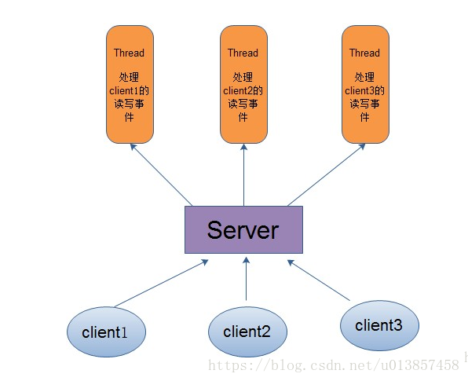
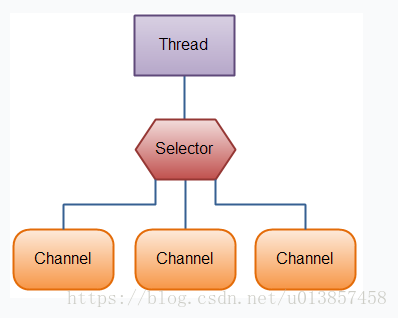
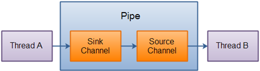

# JAVA NIO 简介
    JAVA NIO有两种解释：一种叫非阻塞IO（Non-blocking I/O），另一种也叫新的IO（New I/O），其实是同一个概念。它是一种同步非阻塞的
    I/O模型，也是I/O多路复用的基础，已经被越来越多地应用到大型应用服务器，成为解决高并发与大量连接、I/O处理问题的有效方式。
    
    NIO是一种基于通道和缓冲区的I/O方式，它可以使用Native函数库直接分配堆外内存（区别于JVM的运行时数据区），然后通过一个存储在java
    堆里面的DirectByteBuffer对象作为这块内存的直接引用进行操作。这样能在一些场景显著提高性能，因为避免了在Java堆和Native堆中来回复制数据。
-----------------------
## JAVA NIO组件
    NIO主要有三大核心部分：Channel(通道)，Buffer(缓冲区), Selector（选择器）。传统IO是基于字节流和字符流进行操作（基于流），
    而NIO基于Channel和Buffer(缓冲区)进行操作，数据总是从通道读取到缓冲区中，或者从缓冲区写入到通道中。Selector(选择区)用于监听
    多个通道的事件（比如：连接打开，数据到达）。因此，单个线程可以监听多个数据通道。
    1、Buffer
        Buffer（缓冲区）是一个用于存储特定基本类型数据的容器。除了boolean外，其余每种基本类型都有一个对应的buffer类。Buffer类的
        子类有ByteBuffer, CharBuffer, DoubleBuffer, FloatBuffer, IntBuffer, LongBuffer, ShortBuffer 。
    2、Channel
        Channel（通道）表示到实体，如硬件设备、文件、网络套接字或可以执行一个或多个不同 I/O 操作（如读取或写入）的程序组件的开放的
        连接。Channel接口的常用实现类有FileChannel（对应文件IO）、DatagramChannel（对应UDP）、SocketChannel和
        ServerSocketChannel（对应TCP的客户端和服务器端）。Channel和IO中的Stream(流)是差不多一个等级的。只不过Stream是单向的，
        譬如：InputStream, OutputStream.而Channel是双向的，既可以用来进行读操作，又可以用来进行写操作。
    3、Selector
        Selector（选择器）用于监听多个通道的事件（比如：连接打开，数据到达）。因此，单个的线程可以监听多个数据通道。即用选择器，
        借助单一线程，就可对数量庞大的活动I/O通道实施监控和维护。
    
    基于阻塞式I/O的多线程模型中，Server为每个Client连接创建一个处理线程，每个处理线程阻塞式等待可能达到的数据，一旦数据到达，则立
    即处理请求、返回处理结果并再次进入等待状态。由于每个Client连接有一个单独的处理线程为其服务，因此可保证良好的响应时间。但当系统
    负载增大（并发请求增多）时，Server端需要的线程数会增加，对于操作系统来说，线程之间上下文切换的开销很大，而且每个线程都要占用系
    统的一些资源（如内存）。因此，使用的线程越少越好。
--------------------------------------   
**传统IO处理方式，一个线程处理一个连接请求** 
---------------------

-------------------------
**NIO处理方式，一个线程可以管理多个网络连接**

----------------------------
## NIO Channel 详解
    在Java NIO中，通道是用于在实体和字节缓冲区之间有效传输数据的介质。它从一个实体读取数据，并将其放在缓冲区块中以供消费。
    
    通道作为Java NIO提供的网关来访问I/O机制。 通常，通道与操作系统文件描述符具有一对一关系，用于提供平台独立操作功能。
---------------------------
java.nio.channels类的层次结构图
---------

----------------
### Java nio channel(通道)基础
    通道实现是使用本地代码执行实际工作，通道接口允许我们以便携和受控的访问低级I/O服务。
----------
### NIO通道的实现
#### 在Java NIO中，主要使用的通道如下：
    1、FileChannel：文件通道用于从文件中读取数据。它只能通过调用getChannel()方法来创建对象。不能直接创建FileChannel对象。
        FileInputStream fis = new FileInputStream("D:\\file-read.txt"); // 文件的地址 
        ReadableByteChannel rbc = fis.getChannel();
    
    2、DatagramChannel：数据报通道可以通过UDP(用户数据报协议)通过网络读取和写入数据。它使用工厂方法来创建新对象。
        DatagramChannel ch = DatagramChannel.open();
        DatagramChannel ch = DatagramChannel.close();
    
    3、SocketChannel：数据报通道可以通过TCP(传输控制协议)通过网络读取和写入数据。 它还使用工厂方法来创建新对象。
     
    
    4、ServerSocketChannel：ServerSocketChannel允许用户监听传入的TCP连接，与Web服务器相同。对于每个传入连接，都会为连接创建一个SocketChannel.
---------------------------
###JAVA NIO管道(单向通道)
####NIO管道基础
    Java NIO管道用于在两个线程之间建立单向数据连接。它有一个槽通道和源通道。数据正在写入槽通道，然后可以从源通道读取该数据。
    
    在Java NIO中，包java.nio.channel.pipe用于按顺序读取和写入数据。管道用于确保数据必须以写入管道的相同顺序读取。
--------------------
***管道原理图***    

----------------
####NIO管道使用
    要创建一个管道 ，可通过调用Pipe.open()方法打开管道。
    基本语法如下：
        Pipe p = Pipe.open();
        
    从管道中读取数据：
        要从管道中读取数据，首先要访问源管道(source Channel)
        
        Pipe.SourceChannel sc = pipe.source();
        ByteBuffer buffer = ByteBuffer.allocate(512);
        sc.read(buffer);
        
        read方法是有返回值，返回整数，表示读入到buffer中的字节数。
        
    写入管道数据：
        要将数据写入管道，需要访问接收器通道（sink channel）
        
        Pipe.SinkChannel sc = pipe.sink();
        String wirteData = new String("");
        ByteBuffer in = ByteBuffer.aollcate(512);
        in.clear();
        in.put(witeData.getBytes());
        in.flip();
        sc.write(in);
    
------------------------------
###NIO selector基础
    在我理解来看，selector对于NIO来说，实际上就是监控NIO channel的产物，可以通过selector获取到channel(通道)的所有状态
    而且通过上面的模型也可以看出来，selector可以监控多个channel。
----------------------
####NIO selector如何监控NIO channel？
    如上描述的问题，在我们程序中的监听一样，都需要将被监控（channel）的对象注册到监视器（selector）中。
    NIO channel提供了很方便的添加监视器（selector）的方法：register。该方法需要两个参数，selector对象以及selectionkey的状态。
    selectionkey状态表示channel在什么状态下触发selector事件（）

###NIO还有字符集、编码、解码等一些基础知识，后续可简单了解一下。
    
    
      
    

    

     
        